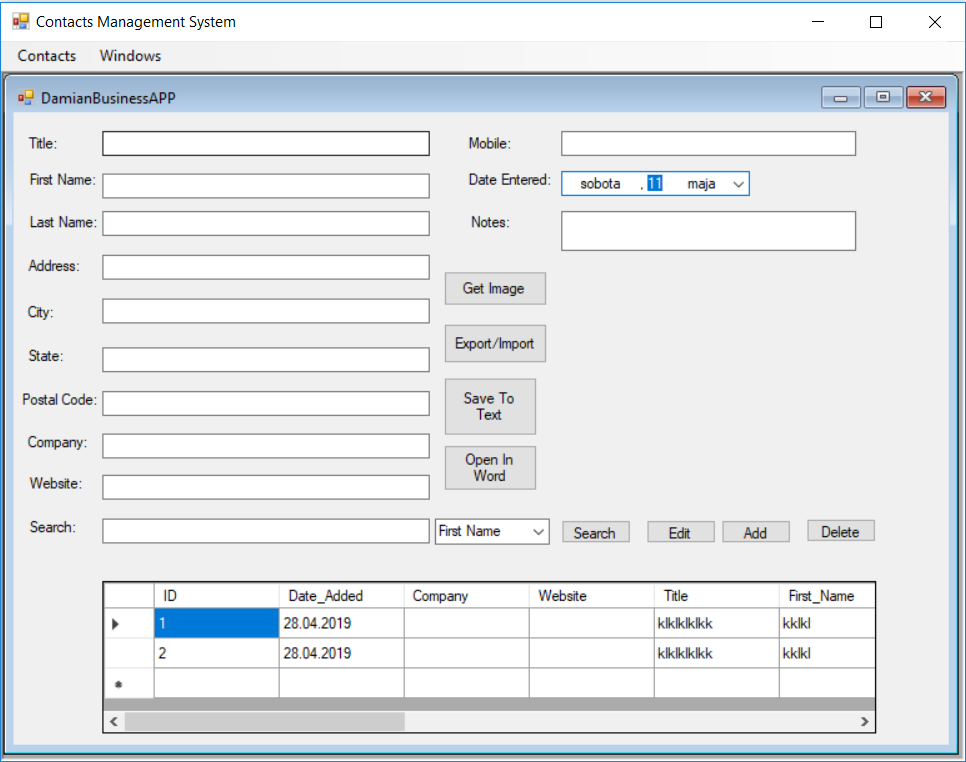

# DamianClientAPP-BusinessContactManager-
This application has been connected with MYSQL database with using LINQ.
How to add connect APP with Databse with LINQ :click project in visual studio Taskbar>add>new item>linq to sql>object
Some special features:
-you can save a profile with or without a photo,
-you can import and export the excel file,
-you can open the file in word,

If something is wrong and your application does not work as should,
then i proposal you to check again did you wrote these namespaces,because that its very important to make all functions available to use.
dont forget to add those name spaces
using System.IO; // needed for File use
using System.Diagnostics; // needed to open up excel from our code
using Microsoft.Office.Interop.Excel; // needed to make an excel object in our code
using Microsoft.Office.Interop.Word;

Feel invited to discover his functions. Enjoy !:)

